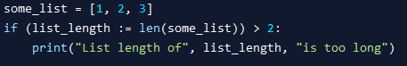

# 2024FEB09 Morning TODO:

1. Create new umlgenerator class
2. Template the code, using IF/ELSIF statements similar to cases
   1. Add wrappers to places where methods may be used/defined.
   2. Regex Match/checks could be added to if/elsif statements, ie:
      1. 
3. Using the new subStateNode class, replace parsing from the point of a substate being found
   1. This should encapsulate the defining of a substate to be put inside a method\
   2. Should be able to output standalone UML code, some links may be undefined, but is okay
4. 
